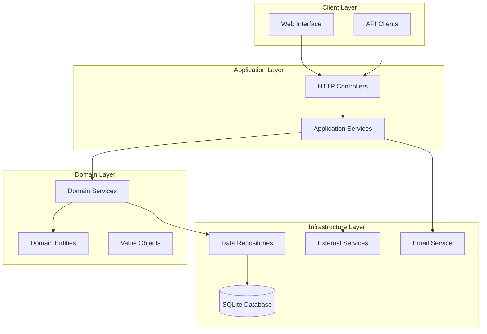
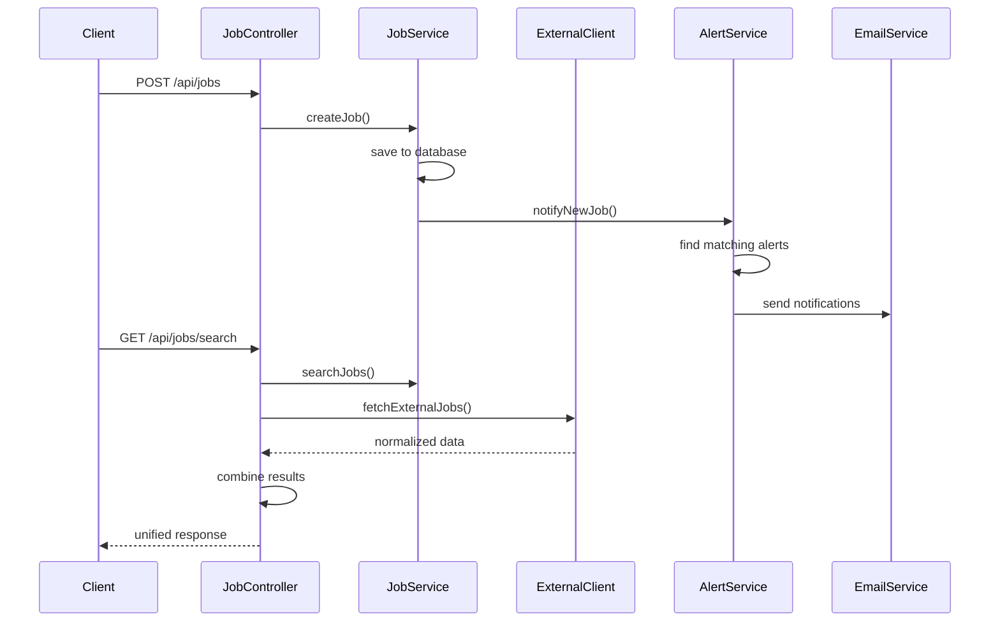
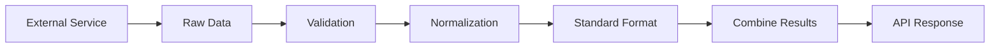
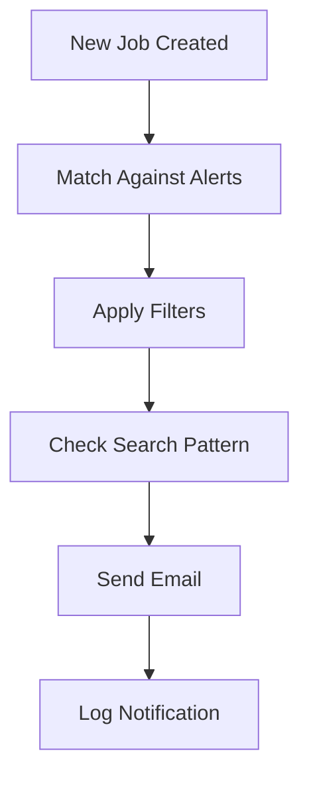

## Jobberwocky - Job Marketplace Platform

A comprehensive job posting and search platform built with modern PHP architecture, implementing Clean Architecture principles and Domain-Driven Design patterns.

## Project Overview

Jobberwocky companies to post job opportunities and candidates to search and subscribe to job alerts. The platform integrates multiple data sources and provides a unified search experience across internal and external job listings.

## System Architecture

### High-Level Architecture



### Service Integration Flow



## Key Features

### Core Requirements Implementation

1. **Job Posting Service**
   - RESTful API for job creation
   - Comprehensive data validation
   - Automatic alert notifications

2. **Job Search Service**
   - Advanced search with multiple filters
   - Pagination support
   - Combined internal/external results

3. **External Source Integration**
   - Seamless integration with jobberwocky-extra-source
   - Data normalization and standardization
   - Graceful error handling

4. **Job Alerts System**
   - Email-based notifications
   - Configurable search patterns
   - Advanced filtering options

## Technology Stack

- **Backend**: PHP 8.2+ with Symfony 6.3
- **Database**: SQLite with Doctrine ORM
- **Architecture**: Clean Architecture + DDD
- **Testing**: PHPUnit with comprehensive coverage
- **Containerization**: Docker & Docker Compose
- **External Integration**: Node.js service simulation

## Project Structure

```
src/
├── Domain/                    # Core business logic
│   ├── Entity/               # Job, JobAlert entities
│   ├── ValueObject/          # Type-safe value objects
│   ├── Repository/           # Repository interfaces
│   └── Service/              # Domain services
├── Application/              # Application layer
│   └── Service/              # Application services
└── Infrastructure/           # External concerns
    ├── Controller/           # HTTP endpoints
    ├── Repository/           # Data persistence
    ├── External/             # External API clients
    └── Email/                # Notification service
```

## Quick Start

### Prerequisites
- PHP 8.2+
- Composer
- Docker & Docker Compose

### Installation

```bash
# Clone repository
git clone <repository-url>
cd hp-dev-jobberwocky_OctavioMinteguia_232083

# Install dependencies
composer install

# Start services
docker-compose up -d

# Access the application
open http://localhost:8000/demo.html
```

## API Documentation

### Job Management

#### Create Job
```http
POST /api/jobs
Content-Type: application/json

{
  "title": "Senior PHP Developer",
  "company": "TechCorp",
  "description": "Looking for experienced PHP developer...",
  "location": "Buenos Aires",
  "salary": "$5000 - $7000",
  "type": "full-time",
  "level": "senior",
  "tags": ["PHP", "Symfony", "MySQL"],
  "remote": true
}
```

#### Search Jobs
```http
GET /api/jobs/search?q=PHP&location=Buenos Aires&remote=true&limit=10
```

#### Get Job Details
```http
GET /api/jobs/{id}
```

### Job Alerts

#### Subscribe to Alerts
```http
POST /api/job-alerts
Content-Type: application/json

{
  "email": "candidate@example.com",
  "searchPattern": "PHP developer",
  "filters": {
    "location": "Buenos Aires",
    "type": "full-time",
    "level": "senior"
  }
}
```

#### Unsubscribe from Alerts
```http
DELETE /api/job-alerts/{id}
```

## Testing Strategy

### Test Coverage
- **Unit Tests**: Domain entities and services
- **Integration Tests**: API endpoints
- **Contract Tests**: External service integration
- **End-to-End Tests**: Complete user workflows

### Running Tests
```bash
# Run all tests
composer test

# Run with coverage
composer test-coverage

# Run specific test suite
./vendor/bin/phpunit tests/Domain/
```

## Code Quality & Standards

### Static Analysis
- **PHPStan**: Level 8 static analysis
- **PHP CS Fixer**: PSR-12 compliance
- **PHPUnit**: Comprehensive test coverage

### Architecture Principles
- **SOLID Principles**: Single responsibility, dependency inversion
- **Clean Architecture**: Clear layer separation
- **Domain-Driven Design**: Rich domain models
- **Test-Driven Development**: Test-first approach

## External Service Integration

### Data Normalization Process



The system handles inconsistent external data formats by:
- **Field Mapping**: Converting various field names to standard format
- **Data Validation**: Ensuring data quality and completeness
- **Type Conversion**: Standardizing data types and formats
- **Error Handling**: Graceful degradation when external service fails

## Email Notification System

### Alert Processing Flow



Features:
- **HTML & Text Formats**: Maximum email client compatibility
- **Rich Templates**: Professional email formatting
- **Configurable SMTP**: Easy production deployment
- **Delivery Tracking**: Comprehensive logging

## Docker Configuration

### Multi-Service Architecture
- **PHP Application**: Symfony-based API service
- **Node.js Simulator**: External job source simulation
- **SQLite Database**: Lightweight data persistence

### Development Environment
```yaml
services:
  app:
    build: .
    ports: ["8000:8000"]
    volumes: [".:/var/www/html"]
  
  jobberwocky-extra-source:
    image: node:18-alpine
    ports: ["3001:3001"]
    volumes: ["./external-source:/app"]
```

## Security & Performance

### Security Measures
- **Input Validation**: Comprehensive data sanitization
- **SQL Injection Protection**: Doctrine ORM parameterized queries
- **XSS Prevention**: Output escaping in templates
- **Rate Limiting Ready**: Symfony rate limiter integration

### Performance Optimizations
- **Database Indexing**: Optimized query performance
- **Efficient Pagination**: Offset/limit implementation
- **Lazy Loading**: Doctrine lazy loading patterns
- **Caching Ready**: Redis integration prepared

## Scalability Considerations

### Horizontal Scaling
- **Stateless Design**: No server-side session dependency
- **Database Optimization**: Efficient query patterns
- **External Service Resilience**: Circuit breaker patterns
- **Load Balancer Ready**: Stateless application design

### Future Enhancements
- **Authentication**: JWT-based API security
- **Message Queues**: Async job processing
- **Caching Layer**: Redis for performance
- **Monitoring**: Application performance metrics

## Business Value

### For Companies
- **Easy Job Posting**: Simple API integration
- **Wide Reach**: Combined internal/external visibility
- **Targeted Notifications**: Reach qualified candidates

### For Candidates
- **Unified Search**: Single interface for all jobs
- **Smart Alerts**: Personalized job notifications
- **Advanced Filtering**: Precise job matching

## Technical Highlights

### Architecture Decisions
- **Clean Architecture**: Maintainable and testable codebase
- **Domain-Driven Design**: Rich business logic modeling
- **SOLID Principles**: Flexible and extensible design
- **Test-Driven Development**: Reliable and robust implementation

### Integration Patterns
- **Adapter Pattern**: External service integration
- **Repository Pattern**: Data access abstraction
- **Service Layer**: Business logic encapsulation
- **Observer Pattern**: Event-driven notifications

---

## Demo & Testing

Access the interactive demo at: `http://localhost:8000/demo.html`

The demo interface provides:
- **API Testing**: Interactive endpoint testing
- **Job Management**: Create and search jobs
- **Alert Subscription**: Email notification setup
- **Real-time Results**: Live API responses

---

**Built with modern PHP practices, Clean Architecture, and a focus on maintainability and scalability.**
